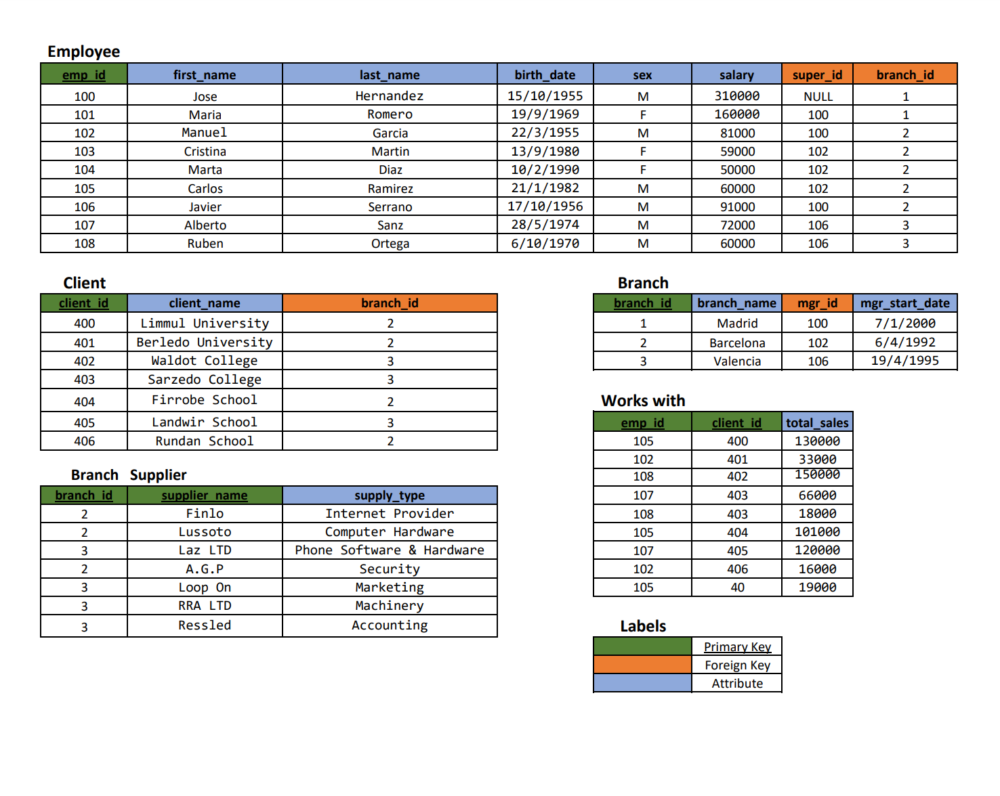

# SQL Complex Database Schema

In this SQL script I build an advanced database schema, with a number of tables and defined relationships such as, for example, foreign keys.
I will also populate the database with some information in order to demonstrate furthermore the relationships within the database.

#### This script is a part of a bigger project for a Spanish company.   I populate the database with some information in order to demonstrate furthermore the correlation within the database.   The populated data is not the original and has been modified for privacy purposes; not the numerical data nor the names/labels are the ones used in the original project.

